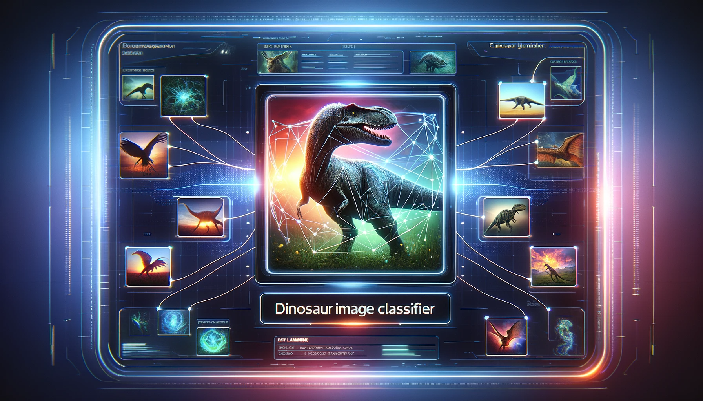

# Dinosaur Image Classifier

## These are the codes behind my Hugging Face Space - Gradio APP that lets you upload a photo (of a dinosaur) and it will classify which species the dinosaur is.
## See it here: https://huggingface.co/spaces/mxlars/DinoClassifier

### In order for this to code to work, you must run my Jupyter Notebook in Kaggle and download the model, and then add the model "dinosaur_classifier.pkl" into the folder "DinoClassifier"
### Link: https://www.kaggle.com/code/larserikrisholm/dinosaur-species-image-classifier

### P.S. Only top 15 dinosaurs from Jurassic Park has been trained in this model. If you want to play along and add additional feutures, you can copy my notebook and easily add more dinosaurs etc. Enjoy!
